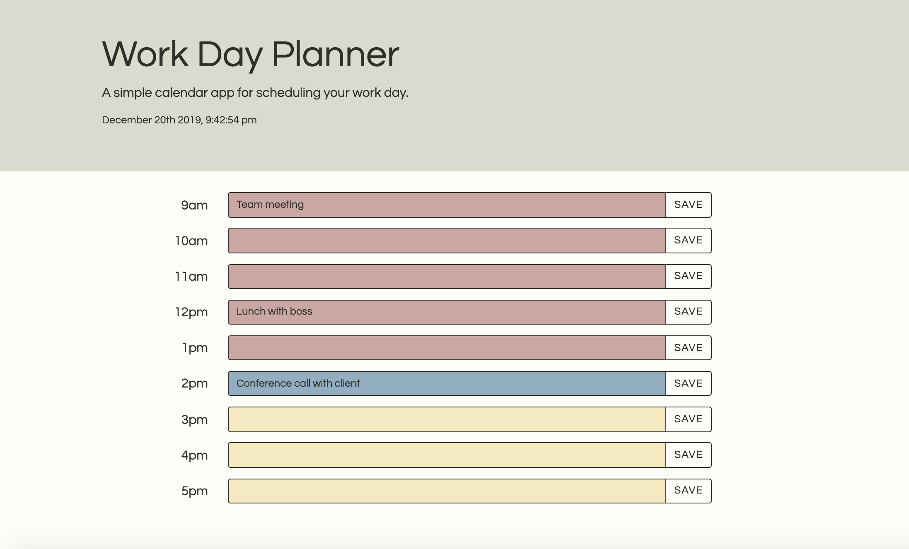

# Work Day Planner

This project is intended to produce a simple calendar app that allows the user to schedule their work day. The user may save their input in each field and review the information at any point in the future. The current date and time is displayed in the header, and depending on the time of day the input fields will be color coded accordingly.

# Getting Started

1. Place text into desired input field
2. Click the save button on the right-hand side
3. All text is stored in the browser and will remain visible in the input field
4. Delete the text and click save to clear the field

# Built With

Bootstrap - https://getbootstrap.com/

jQuery - https://jquery.com/

Moment.js - https://momentjs.com/

# Link

https://atb5498.github.io/work-day-planner/

